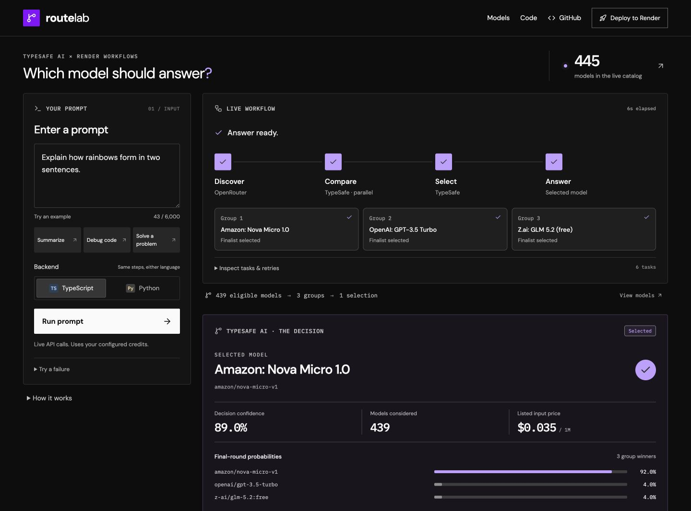
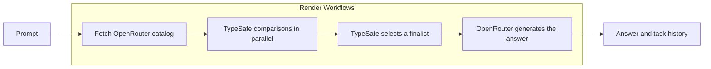

<div align="center">

# Route Lab

Give TypeSafe a prompt. Watch it choose an OpenRouter model, then see that model answer.
Render Workflows runs the steps, parallel comparisons, and retries.

<p>
  <a href="https://render.com/deploy?repo=https%3A%2F%2Fgithub.com%2Fojusave%2Froute-lab&amp;utm_source=github&amp;utm_medium=referral&amp;utm_campaign=ojus_demos&amp;utm_content=readme_deploy">
    
  </a>
</p>

[TypeScript example](typescript/README.md) · [Python example](python/README.md) · [How it works](#how-it-works) · [Run locally](#run-locally)

</div>



_Screenshot of a real local run. Both examples are locally tested; a hosted demo has not been deployed._

## What this demo shows

| Tool                                                      | Role                                                                              |
| --------------------------------------------------------- | --------------------------------------------------------------------------------- |
| [TypeSafe AI](https://docs.typesafe.ai/primitives/choice) | Jev returns a structured model choice, probabilities, and confidence.             |
| [Render Workflows](https://render.com/docs/workflows)     | Runs the dependency graph, compares groups in parallel, and retries failed tasks. |
| [OpenRouter](https://openrouter.ai/models)                | Supplies the current model catalog and calls the selected model.                  |

The main view contains the prompt and live results. **Models** opens the full searchable catalog. **Code** opens the actual task definitions. Task states update every second from Render; answers appear when generation finishes.

## Deploy one example

Python and TypeScript deploy independently. Each has one paid web service and its own Workflow. They share frontend source and a selection policy, but neither deployed backend calls the other.

| Example                            | Blueprint Path                             | Web runtime | Task entry point                                           |
| ---------------------------------- | ------------------------------------------ | ----------- | ---------------------------------------------------------- |
| [TypeScript](typescript/README.md) | [`render.yaml`](render.yaml)               | Node.js     | [`typescript/src/workflow.ts`](typescript/src/workflow.ts) |
| [Python](python/README.md)         | [`python/render.yaml`](python/render.yaml) | Python      | [`python/app/workflow.py`](python/app/workflow.py)         |

1. Click **Deploy to Render** above. The default Blueprint deploys TypeScript. For Python, set **Blueprint Path** to `python/render.yaml`.
2. Leave **Root Directory** empty. Both Blueprints run build commands from the repository root.
3. Enter the three keys when prompted, review the paid resources, and deploy.
4. Open the new web service URL and run an example prompt.

| Credential           | Where it is used                                 |
| -------------------- | ------------------------------------------------ |
| `RENDER_API_KEY`     | Web service: starts runs and reads their status. |
| `TYPESAFE_API_KEY`   | Workflow: selects a model.                       |
| `OPENROUTER_API_KEY` | Workflow: calls the selected model.              |

You need a [Render account](https://dashboard.render.com/register?utm_source=github&utm_medium=referral&utm_campaign=ojus_demos&utm_content=readme_link), a [Render API key](https://render.com/docs/api#1-create-an-api-key), a [TypeSafe key](https://docs.typesafe.ai), and an [OpenRouter key](https://openrouter.ai/keys).

The web services use the paid `0.5c-512mb` plan. Tasks explicitly use usage-billed `flex` in SDK code. A Workflow has no service-level `plan` field. `fromService` supplies each web service's Workflow slug automatically. Provider keys stay on the Workflow. Auto-deploy is off so upstream changes do not automatically redeploy your copy.

The demo does not include user authentication or a shared spending quota. Use restricted provider budgets, or add access controls before opening a deployment to unrestricted public traffic.

## Run locally

Requires Node.js 22.12+, Python 3.11+ for the Python example, uv, and Render CLI 2.12+.

```sh
git clone https://github.com/ojusave/route-lab.git
cd route-lab
npm ci
cp .env.example .env
```

Add the TypeSafe and OpenRouter keys to `.env`. Then choose an example:

```sh
# TypeScript only
npm run dev:typescript

# Or Python only
uv sync --project python --frozen
npm run dev:python
```

Open **http://127.0.0.1:5173**. Each command starts only that language's API and local Render task server, plus the frontend. Use `npm run dev` to run both and compare them in one UI. Stop with Ctrl+C. Local logs are in the ignored `work/dev.log` file.

Local execution uses the real Render SDK and CLI with live provider calls. It does not require a Render API key. Local run history is in memory and disappears when the task server stops.

## How it works



Every run fetches the full OpenRouter catalog. Text-in/text-out compatibility and a conservative context check determine which models participate. Other models remain visible with exclusion reasons. The catalog does not guarantee that your account can invoke every entry.

A live TypeSafe request with 439 choices returned a maximum of **255 choices per question**. The demo therefore splits eligible models into groups of up to 200, selects one winner per group, and asks TypeSafe to choose among those winners. This makes the parallel work and join visible, while allowing every compatible model to participate.

Selection uses vendor descriptions, context limits, listed prices, reasoning support, and the policy in [`shared/config.json`](shared/config.json). Descriptions are shortened before selection. Grouping can affect the winner. **This demonstrates model routing; it does not establish which model produces the best answer.**

Final-round probabilities apply only to finalists. [TypeSafe confidence](https://docs.typesafe.ai/confidence) describes the decision distribution, not answer accuracy. Token counts and generation cost come from OpenRouter when available. Generation cost excludes TypeSafe calls and Render compute.

## Try retries

Open **Try a failure** and enable **Fail the answer task on purpose**. TypeSafe still makes a real selection, but the answer task fails before calling OpenRouter. Render retries it twice. The UI keeps the completed selection and shows all three attempts.

Turn the option off and start a new run to get an answer. This starts fresh; it does not resume the failed root run. Child tasks retry twice, while the root has no automatic retries. External calls are not exactly once: a provider request accepted before a timeout can be charged again if retried.

## Read the code

Both backends use the same small set of modules:

| Responsibility                     | TypeScript                                    | Python                                    |
| ---------------------------------- | --------------------------------------------- | ----------------------------------------- |
| Task graph, parallel work, retries | [`workflow.ts`](typescript/src/workflow.ts)   | [`workflow.py`](python/app/workflow.py)   |
| Live catalog and compatibility     | [`catalog.ts`](typescript/src/catalog.ts)     | [`catalog.py`](python/app/catalog.py)     |
| TypeSafe and OpenRouter calls      | [`providers.ts`](typescript/src/providers.ts) | [`providers.py`](python/app/providers.py) |
| Run status and results             | [`runs.ts`](typescript/src/runs.ts)           | [`runs.py`](python/app/runs.py)           |
| HTTP API and built frontend        | [`server.ts`](typescript/src/server.ts)       | [`server.py`](python/app/server.py)       |

TypeScript uses `@renderinc/sdk` and `@typesafe-ai/sdk`. Python uses `render` and `typesafe-sdk`. OpenRouter calls use fetch and httpx. Narrow Render REST reads supply task names and the Python SDK's currently unexposed `rootTaskRunId` list filter.

The React frontend lives in `frontend/`. `npm run build` produces separate `dist/typescript` and `dist/python` bundles, each configured for its own API. Each web service serves its corresponding bundle.

## Checks

```sh
npm run build
npm test
python/.venv/bin/python -m unittest discover -s python -p 'test_*.py'
render blueprints validate render.yaml -o json
render blueprints validate python/render.yaml -o json
```

With the local servers running, these tests use real provider credits:

```sh
node tests/live-smoke.mjs
node tests/failure-smoke.mjs
```

[`live-evidence.json`](tests/live-evidence.json) and [`failure-evidence.json`](tests/failure-evidence.json) record local runs from September 17, 2026. Both backends completed the 439-candidate flow with six child tasks. Deliberate failures preserved the selection and made three answer-task attempts. The UI was inspected on desktop and mobile, including catalog search, code tabs, keyboard dismissal, and focus return. Cloud execution and novice usability have not been tested.

## Forking and attribution

After forking, update the repository links and both Blueprints:

```sh
npm run configure:repo -- https://github.com/YOUR_OWNER/YOUR_REPOSITORY
```

Restart development or rebuild afterward. On Render, the frontend derives its GitHub URL from `RENDER_GIT_REPO_SLUG`; `VITE_REPOSITORY_URL` overrides it.

Render links reuse the attribution from Ojus's other examples: `utm_source=github`, `utm_medium=referral`, and `utm_campaign=ojus_demos`. `utm_content` distinguishes the signup and deploy placements. [`shared/links.ts`](shared/links.ts) constructs the URLs. These tags identify referrals; the demo does not independently measure conversions.

## Sources

API behavior and deployment configuration were checked against [TypeSafe Choice](https://docs.typesafe.ai/primitives/choice), [Render Workflow tasks](https://render.com/docs/workflows-defining), the [Blueprint reference](https://render.com/docs/blueprint-spec), the [September 16 Workflow Blueprint announcement](https://render.com/changelog/added-blueprint-support-for-render-workflows), and [OpenRouter's catalog](https://openrouter.ai/api/v1/models).

The layout follows Render's neutral surfaces, purple accents, thin borders, and button hierarchy. Live status and the optional detail panels follow [NN/g's system-status guidance](https://www.nngroup.com/articles/visibility-system-status/) and [W3C status-message guidance](https://www.w3.org/WAI/WCAG21/Understanding/status-messages.html). No proprietary Render fonts are bundled.
