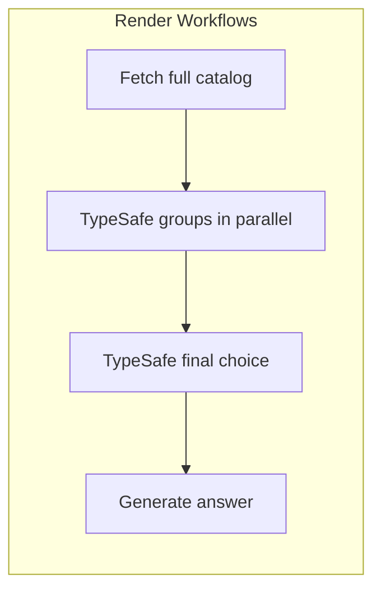

# Development notes

## Task flow



The parent `answer_prompt` waits for all group tasks before starting the final choice. Every compatible model participates. Child tasks retry twice; the parent does not retry automatically. A new prompt run repeats the work.

The UI polls actual task state once a second. Answers appear when generation finishes. Opening a run URL reconnects to that run; refreshing does not submit it again. The failure option stops the answer task before calling the provider, so its retries do not spend generation credits.

## Provider boundary

Both examples expose two adapter operations:

- **Catalog:** return normalized models, fetch time, and duration.
- **Generate:** accept a prompt and normalized model; return text, model ID, usage, duration, and finish reason.

TypeScript checks this contract in `typescript/src/provider.ts`; shared payload shapes are in `shared/types.ts`. Python uses the same JSON shapes through `python/app/provider.py`. Each provider’s HTTP requests and response mapping belong in its adapter.

Together AI or another provider may need a separate catalog source, pricing metadata, different model IDs, or different reasoning parameters. Implement those in the new adapter, then change the provider import, environment variables, and display labels in `shared/config.json`. No alternate provider has been implemented or tested here.

The model policy is also in `shared/config.json`. It uses descriptions, context, capabilities, and prices. It cannot establish answer quality. TypeSafe’s observed 255-choice limit requires grouped selection; final probabilities apply only to group winners. Generation cost excludes TypeSafe and Render charges.

## Deployment

The root Blueprint deploys TypeScript. `python/render.yaml` deploys Python. Each web service serves a separate frontend build and calls its own Workflow. The two examples share frontend source and the routing policy, but have no runtime dependency on each other.

Provider keys stay on the Workflow. The web service needs a Render API key and a Workflow slug. The Blueprint supplies the slug through `fromService`. Auto-deploy is off.

Run IDs act as shareable links to prompts and results. Each app rejects runs belonging to another Workflow. This demo has no user authentication or shared spending quota. Use provider spending limits or add access controls for unrestricted public traffic. External provider calls are not exactly once: a retry after an ambiguous timeout can incur another charge.

## Checks

```sh
npm run build
npm test
python/.venv/bin/python -m unittest discover -s python -p 'test_*.py'
render blueprints validate render.yaml -o json
render blueprints validate python/render.yaml -o json
```

With local servers running, `node tests/live-smoke.mjs` and `node tests/failure-smoke.mjs` use real provider credits. Evidence files under `tests/` record local and hosted runs. Both hosted examples completed real 439-model runs and deliberate three-attempt failures on September 17, 2026. `cloud-deployment-evidence.json` records their resources and deployed revisions. Local task history disappears when the CLI task server stops. Launcher logs are in ignored `work/dev.log`.

## Forking

```sh
npm run configure:repo -- https://github.com/YOUR_OWNER/YOUR_REPOSITORY
```

This updates both Blueprints and local frontend links. Render builds derive the repository URL from `RENDER_GIT_REPO_SLUG`; `VITE_REPOSITORY_URL` overrides it. Render links use `github / referral / ojus_demos` UTMs, with placement-specific `utm_content` values.

## API references

[Render task definitions](https://render.com/docs/workflows-defining) · [Workflow Blueprint support](https://render.com/changelog/added-blueprint-support-for-render-workflows) · [Blueprint schema](https://render.com/docs/blueprint-spec) · [TypeSafe Choice](https://docs.typesafe.ai/primitives/choice) · [OpenRouter catalog](https://openrouter.ai/api/v1/models)
